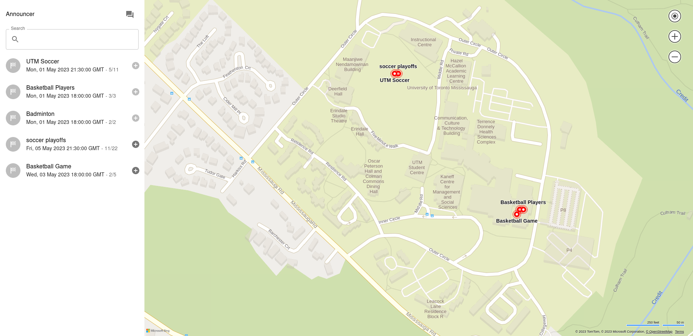

# A prototype for the Deerhacks Hackathon

For the [Deerhacks hackathon](https://deerhacks.mcss.club/), my partner and I decided to build an event software that allows student to schedule and plan events easily. It isn't a secret that the UTM campus lacks a sense of community and social life between students so this was our attempt to fix it :grin:.

    

